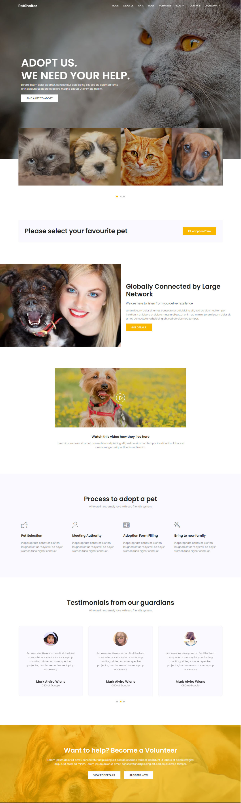

# Лабораторні роботи з основ фронтенд-технологій

**Виконав:** Семен Прохода ІП-з31

## Посилання на всі [Лабораторні роботи](https://simonrog.github.io/Frontend_basics/)

## Посилання на	репозиторій [GitHub](https://github.com/simonrog/Frontend_basics)

Звіт зроблено у форматі Markdown ([readme.md](https://github.com/SimonRoG/Frontend_basics/blob/main/readme.md)). Конвертовано у PDF за допомогою [Pandoc](https://pandoc.org/) з використанням команди:

```bash
pandoc readme.md -o readme.pdf --pdf-engine=xelatex \
-V mainfont="FreeSerif" \
-V monofont="Noto Sans Mono" \
-V fontsize=12pt \
-V lang=uk \
-V geometry=margin=1.5cm \
-V papersize=a4 \
-V colorlinks=true
```

## Лабораторна робота 1

### Завдання до роботи:

1. Створити HTML-сторінку з тегами `<title>` (ПІБ, група) і `<meta>` (кодування, keywords, description).
2. Додати три абзаци: ПІБ (H2), дата і місце народження, освіта.
3. Описати хобі у ненумерованому списку.
4. Вказати улюблені книги у нумерованому списку.
5. Написати абзац про улюблене місто.
6. Додати фото цього міста.
7. Зробити гіперпосилання на фото з адресою сайту міста.
8. Використати Git.
9. Перевірити HTML валідатором.

### Виконання:

[Лістинг коду: GitHub](https://github.com/simonrog/Frontend_basics/blob/main/1)

Посилання на сторінку: [Лабораторна робота №1](https://simonrog.github.io/Frontend_basics/1/)

Валідований сайт: [Validated site](https://validator.w3.org/nu/?doc=https%3A%2F%2Fsimonrog.github.io%2FFrontend_basics%2F1%2F)

### Коментарі до роботи:

-   Я не вказував дату народження, оскільки вважаю це особистою інформацією.

## Лабораторна робота 2

### Завдання до роботи:

1. Створити HTML-таблицю з ПІБ у першому рядку, групою, номером лабораторної та варіантом у другому.
2. Додати CSS для фону першого та другого рядків (#nn8f8f, #f5f5nn), контрастний текст, зміну кольорів при наведенні (hover).
3. Створити зображення через transform. CSS зберегти у style.css.

### Виконання:

[Лістинг коду: GitHub](https://github.com/simonrog/Frontend_basics/blob/main/2)

Посилання на сторінку: [Лабораторна робота №2](https://simonrog.github.io/Frontend_basics/2/)

## Лабораторна робота 3

### Завдання до роботи:

1. Зробити блочну верстку макету сайту з використанням float і width у %.
2. Зробити верстку цього ж макету за допомогою Flex.

### Виконання:

[Лістинг коду: GitHub](https://github.com/simonrog/Frontend_basics/blob/main/3)
Посилання на сторінку: [Лабораторна робота №3](https://simonrog.github.io/Frontend_basics/3/)

## Лабораторна робота 4

### Завдання до роботи:

1. Додати до лабораторної №1 файли style.css та script.js.
2. Реалізувати в script.js:
    - При першому кліку на елементі з номером (n mod 10)+1 змінити колір фону та тексту через getElementById().
    - При кліку на наступному елементі — змінити кольори через querySelector().
    - При повторних кліках кольори змінюються знову.
3. Під зображенням додати 4 кнопки: додати, збільшити, зменшити, видалити зображення.

### Виконання:

[Лістинг коду: GitHub](https://github.com/simonrog/Frontend_basics/blob/main/4)

[Лабораторна робота №4](https://simonrog.github.io/Frontend_basics/4/)

### Коментарі до роботи:

-   Тестувати елементи списку освіти
-   Використано `toggle` для зміни класів кольорів
-   Для додвання зображення створюється приховане поле вибору файлу

## Лабораторна робота 5

### Завдання до роботи:

1. Сформувати форму, перевірити введені дані через регулярні вирази JS.

    - Якщо дані коректні — показати їх у новому вікні, якщо ні — виділити помилкові рядки.

2. Створити таблицю 6×6, клітинки нумеруються від 1 до 36.
    - Hover на клітинці з номером варіанта — випадковий колір
    - Click — вибір кольору з палітри
    - DblClick (варіант 3): змінити колір клітинок головної діагоналі

### Виконання:

[Лістинг коду: GitHub](https://github.com/simonrog/Frontend_basics/blob/main/5)

[Лабораторна робота №5](https://simonrog.github.io/Frontend_basics/5/)

### Коментарі до роботи:

-   Таблиця створюється через JS
-   У назві групи можна використовувати всі актуальні суфікси та префікси (заочна форма, магістратура, тощо)

## Лабораторна робота 6

### Завдання до роботи:

1. Створити js-скрипт для отримання даних із https://randomuser.me/api за допомогою fetch та promise у форматі JSON

### Виконання:

[Лістинг коду: GitHub](https://github.com/simonrog/Frontend_basics/blob/main/6)

[Лабораторна робота №6](https://simonrog.github.io/Frontend_basics/6/)

### Коментарі до роботи:

-   Спочатку створюється список обіцянок, потім виконується для одночасного отримання даних

## Лабораторна робота 7

### Завдання до роботи:

1. Реалізувати завдання лабораторної №4 з використанням React, розбивши на компоненти: Header (function), Content (class), Image (function).

2. Створити галерею з мінімум 6 товарів на основі компонента GoodsCard, передаючи фото, назву та ціну через props.

### Виконання:

[Лістинг коду: GitHub](https://github.com/simonrog/Frontend_basics/blob/main/7)

[Лабораторна робота №7](https://simonrog.github.io/Frontend_basics/7/)

### Коментарі до роботи:

-   Використано React з Vite для швидкої збірки та тестування проекту
-   Для лабораторної роботи використано React Router (`react-router`) для навігації між сторінками (завданнями 1 та 2)
-   Встановлено пакет `gh-pages` для деплою на GitHub Pages
-   Використано "костиль" для GitHub Pages у вигляді декількох однакових `index.html`, бо GitHub Pages шукає `index.html` у відповідному шляху
    -   конфігурованно у `vite.config.js`
-   Щоб створити базу проекта, використано команду `npm create vite@latest`
-   Для встановлення залежностей використано команду `npm install`
-   Для тестування проекту локально використано команду `npm run dev`
-   Для деплою проекту на GitHub Pages використано команду `npm run deploy`
    -   цей скрипт збирає проект у папку `dist` і пушить її в гілку `deploy` у папку `7`, відповідно до номеру лабораторної роботи
-   Усі скрипти для деплою та збірки проекту вказані у файлі `package.json`
-   Також важливою конфігурацією було налаштування шляху у файлах `vite.config.js`, та `package.json`

## Лабораторна робота 8

### Завдання до роботи:

1. Зробити верстку сайту за своїм варіантом (дизайн зберегти, контент може відрізнятися).



### Виконання:

[Лістинг коду: GitHub](https://github.com/simonrog/Frontend_basics/blob/main/8)

[Лабораторна робота №8](https://simonrog.github.io/Frontend_basics/8/)

### Коментарі до роботи:

-   Використано `vite-plugin-svgr` для імпорту SVG як React-компоненти, для динамічного керування SVG елементами
-   Присутнє відстежування активної сторінки у навігації галереї та людей
-   Усі зображення оптимізовані для швидкого завантаження через image magick, за допомогою `mogrify -resize 50% *.jpg`
-   Усі зображення взяті з [Unsplash](https://unsplash.com/) з відкритою ліцензією
-   Усі SVG іконки взяті з [SVG Repo](https://www.svgrepo.com/) з відкритою ліцензією

## Коментарі до лабораторних робіт:

-   Зробленна підтримка темної теми для всіх лабораторних робіт
